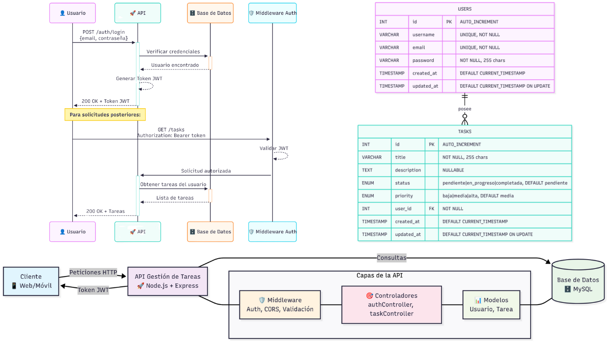
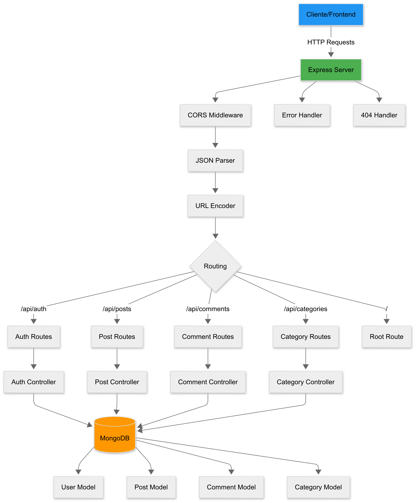
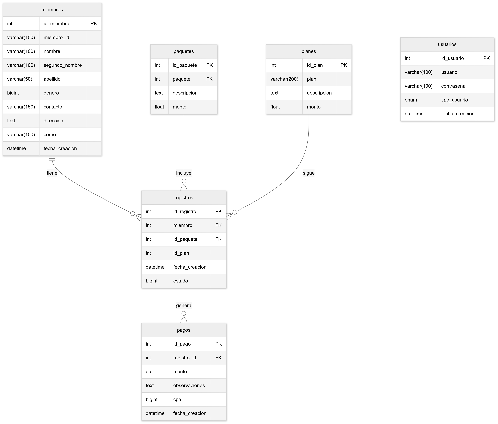

# Portfolio

## Desarrollo de APIs y Sistemas Backend

### 💻 API REST - Sistema de Gestión de Tareas

**API REST** robusta para gestión de tareas desarrollada con **MySQL**, **Node.js** y **Express**. Implementa autenticación segura y operaciones **CRUD** completas. El sistema permite a los usuarios registrarse, autenticarse y administrar sus tareas personales con diferentes estados y prioridades.

  

---

### 📝 Sistema de Blogs

**API backend** para un sistema de blog que permite:
* Autenticación de usuarios (registro/login)
* Gestión de posts (crear, leer, actualizar, eliminar)
* Sistema de comentarios en los posts
* Categorización de contenido
* Base de datos **MongoDB** para persistencia

  

---

### 🏋️‍♂️ Sistema de Gimnasios con GUI
 

Este sistema, diseñado como proyecto final de carrera, utiliza tecnologías como **MySQL**, **PHP** y **BOOTSTRAP** para la administración eficiente de un gimnasio. Proporciona herramientas para la gestión de usuarios, membresías, horarios y más. A continuación, se detallan sus principales módulos:

1.  **Registro de Usuarios y Contraseñas**: Permite el registro seguro de usuarios con autenticación y control de accesos, gestionando roles y permisos.
2.  **Registro de Clientes**: Almacena información personal, historial de pagos y planes de entrenamiento.
3.  **Gestión de Membresías y Paquetes**: Creación, modificación y control de diferentes planes de membresía con automatización de renovaciones.
4.  **Gestión de Horarios y Reservas**: Organización de clases y entrenamientos, optimizando el uso de espacios.
5.  **Generación de Informes**: Creación de reportes detallados sobre membresías, ventas y otros indicadores clave.
6.  **Gestión de Entrenadores y Personal**: Administración de horarios y especialidades del personal.

  

---

### 📚 API REST para Almacenar Libros

API **Node.js** con **Express**, integración con **TypeScript** y **PostgreSQL** como base de datos. Está integrada con **Docker** para un despliegue rápido.

---

### 📊 SQL Avanzado para Grandes Volúmenes de Datos

Optimización de consultas **SQL** con **CTEs**, **window functions** y creación de índices para mejorar el rendimiento en bases de datos con millones de registros. Incluye la aplicación de estrategias de particionado y uso de `EXPLAIN ANALYZE` para monitoreo de performance.

## Habilidades Técnicas  

**Lenguajes y Frameworks**  
- **Backend**: Python (FastAPI, Django REST Framework), Node.js (Express)  
- **Bases de Datos**: PostgreSQL, MySQL, MongoDB  
- **ETL y Procesamiento de Datos**: pandas, SQLAlchemy, Airflow (básico)  
- **Testing**: Pytest, Postman para pruebas de APIs  
- **Contenedores y Despliegue**: Docker, Docker Compose  
- **Versionado y Colaboración**: Git, GitHub, GitFlow  

**Competencias Clave**  
- Desarrollo y consumo de APIs REST  
- Integración de datos y automatización de procesos  
- Modelado y optimización de bases de datos  
- Seguridad en backend (JWT, manejo de credenciales, CORS)  
- Buenas prácticas de código y documentación  

---
## Certificaciones y Formación

- **Tecnicatura en analisis de sistemas informaticos** - *Completado 2024*
- **SQL avanzado** - *Udemy, 2024*
- **Python para ciencia de datos** - *Silicon Misiones, 2024*

---
## Contacto

📧 **Email**: [dossantosaugusto36@gmail.com](mailto:mi.email@ejemplo.com)  
💼 **LinkedIn**: [https://www.linkedin.com/in/augusto-dos-santos-a226622b6/](https://www.linkedin.com/in/augusto-dos-santos-a226622b6/)  
🐙 **GitHub**: [github.com/augustosz](https://github.com/augustosz)  
📍 **Ubicación**: Paraná, Entre Ríos, Argentina

---

© 2025 [Augusto Dos Santos]. Portfolio de Analista de Datos Junior.
