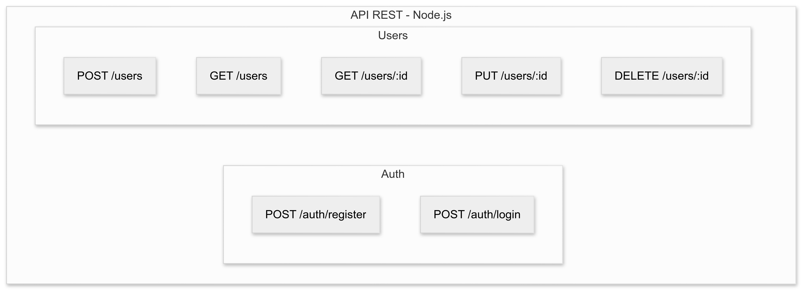

# Portfolio

## Desarrollo de APIs y Sistemas Backend

### API REST - sistema de gestión de tareas

[](https://github.com/augustosz/taskManagment)

**API REST** robusta para gestión de tareas desarrollada con **MySQL**, **Node.js** y **Express**. Implementa autenticación segura y operaciones **CRUD** completas. El sistema permite a los usuarios registrarse, autenticarse y administrar sus tareas personales con diferentes estados y prioridades.

<p align="center">
  
</p>
---

### Sistema de blogs

[](https://github.com/augustosz/sistemaDeBlogs)

**API backend** para un sistema de blog que permite:autenticación de usuarios (registro/login), gestión de posts (crear, leer, actualizar, eliminar), sistema de comentarios en los posts, categorización de contenido, base de datos **MongoDB** para persistencia

<p align="center">
  
</p>

---

### Sistema de gimnasios completo

[](https://github.com/augustosz/gym-repo) [](https://drive.google.com/drive/folders/1gYDL0S_wEO79aIkFAsKQJMc7MNpJwEcP)

Este sistema, diseñado como proyecto final de carrera, utiliza tecnologías como **MySQL**, **PHP** y **BOOTSTRAP** para la administración eficiente de un gimnasio. Proporciona herramientas para la gestión de usuarios, membresías, horarios y más. A continuación, se detallan sus principales módulos:

1.  **Registro de Usuarios y Contraseñas**: Permite el registro seguro de usuarios con autenticación y control de accesos, gestionando roles y permisos.
2.  **Registro de Clientes**: Almacena información personal, historial de pagos y planes de entrenamiento.
3.  **Gestión de Membresías y Paquetes**: Creación, modificación y control de diferentes planes de membresía con automatización de renovaciones.
4.  **Gestión de Horarios y Reservas**: Organización de clases y entrenamientos, optimizando el uso de espacios.
5.  **Generación de Informes**: Creación de reportes detallados sobre membresías, ventas y otros indicadores clave.
6.  **Gestión de Entrenadores y Personal**: Administración de horarios y especialidades del personal.

<p align="center">
  
</p>

---

### NODE JS: API REST (CRUD) con PostgreSQL y JWT

[](https://github.com/portfolio/etl-pipeline-python-sql)

API REST con **Node.js**, **TypeScript** y **PostgreSQL** para gestionar usuarios mediante CRUD, con autenticación segura vía **JWT**. Se desarrolló usando **Express** y **Prisma ORM**, y se despliega fácilmente con **Docker**.

<p align="center">
  
</p>

---

### SQL avanzado para grandes volúmenes de datos

[](https://github.com/augustosz/consultas)

Optimización de consultas **SQL** con **CTEs**, **window functions** y creación de índices para mejorar el rendimiento en bases de datos con millones de registros. Incluye la aplicación de estrategias de particionado y uso de `EXPLAIN ANALYZE` para monitoreo de performance.

```SQL
-- CTE recursiva para jerarquía de empleados
WITH RECURSIVE jerarquia_empleados AS (
    SELECT id_empleado, nombre, id_jefe, 0 as nivel
    FROM empleados 
    WHERE id_jefe IS NULL
    UNION ALL
    SELECT e.id_empleado, e.nombre, e.id_jefe, j.nivel + 1
    FROM empleados e
    INNER JOIN jerarquia_empleados j ON e.id_jefe = j.id_empleado
)
SELECT * FROM jerarquia_empleados
ORDER BY nivel, nombre;
```

## Habilidades Técnicas

**Lenguajes y Frameworks**

- **Backend**: Python (FastAPI, Django REST Framework), Node.js (Express)
- **Bases de Datos**: PostgreSQL, MySQL, MongoDB
- **ETL y Procesamiento de Datos**: pandas, NumPy, SQLAlchemy, Airflow (básico)
- **Testing**: Pytest, Postman para pruebas de APIs
- **Contenedores y Despliegue**: Docker, Docker Compose
- **Versionado y Colaboración**: Git, GitHub, GitFlow

**Competencias Clave**

- Desarrollo y consumo de APIs REST
- Integración de datos y automatización de procesos
- Modelado y optimización de bases de datos
- Seguridad en backend (JWT, manejo de credenciales, CORS)
- Buenas prácticas de código y documentación

---

## Certificaciones y Formación

- **Tecnicatura en analisis de sistemas informaticos** - _Completado 2024_
- **SQL avanzado** - _Udemy, 2024_
- **Python para ciencia de datos** - _Silicon Misiones, 2024_

---

## Contacto

 📧 **Email**: [dossantosaugusto36@gmail.com](mailto:mi.email@ejemplo.com)  
 💼 **LinkedIn**: [https://www.linkedin.com/in/augusto-dos-santos-a226622b6/](https://www.linkedin.com/in/augusto-dos-santos-a226622b6/)  
 🐙 **GitHub**: [github.com/augustosz](https://github.com/augustosz)  
 📍 **Ubicación**: Paraná, Entre Ríos, Argentina

---

<center>© 2025 Augusto Dos Santos. Portfolio de backend junior.</center>
